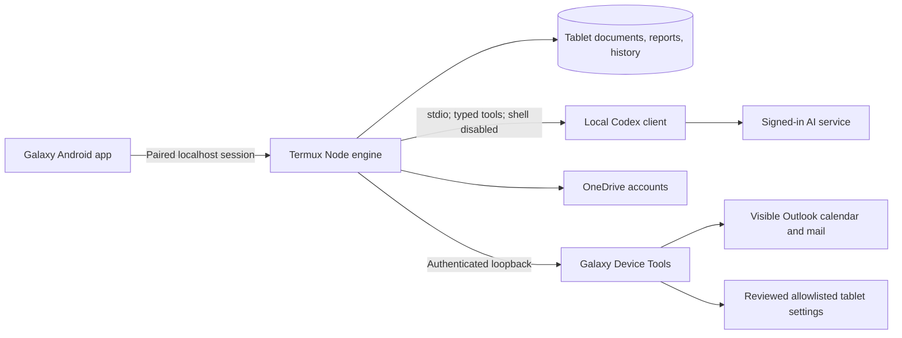
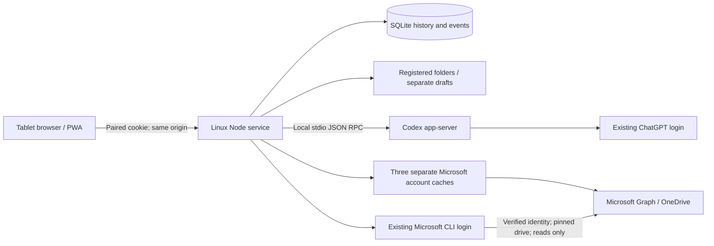

# Galaxy Workspace design and boundaries

Last Updated: 2026-09-22

## Current standalone architecture

The September 22 user instruction supersedes the original host dependency. Galaxy's native launcher and WebView connect to Node/SQLite/files in Termux on the same tablet. A local Codex login supplies AI access over the internet. The optional workstation mode below remains for development; it is not required in meetings.

The helper's native HTTP listener has a private bearer credential, exact loopback Host, no browser Origin, bounded request/response sizes and timeouts, and no shell endpoint. It rejects arbitrary apps, message editors, passwords, send/reply/invitation actions and stale item references. It can read only the active Outlook hierarchy. Android APIs provide device facts and four settings. The settings endpoint is reachable only by the trusted local runtime; browser and model requests still pass proposal/Apply/read-back/Undo controls.

On-device ordinary document workers use five typed tools. Files stay in the selected workspace; edits go to isolated drafts and require content hashes. Quick answers and briefings reject document mutations. This is a trusted single-user pilot, not hardened containment against compromised native code. PRoot does not supply isolation. Runtime data is private to Termux, while selected shared files have Android storage permissions. Microsoft/AI processing still requires network access and can involve sensitive source content.

The helper's two narrowly suppressed Android lint rules are intentional: WRITE_SECURE_SETTINGS is provisioned by the user's development grant for the keyboard setting, and QUERY_ALL_PACKAGES implements the requested installed-app inventory. Neither is a claim of Play Store eligibility. No root, flashing, arbitrary shell, private-app scraping, mailbox export or automatic cloud publication was added.

## Original workstation design (historical context)

## Product direction

The tablet is the conversation and review surface. Linux does the processing. The first workflow is an assessment of real folders and OneDrive documents, followed by an ordinary conversation and a small requested improvement. Structured task contracts are optional future tooling, not a prerequisite for asking a question.

The Perplexity brief was evaluated as source material. Its proposed approval rituals, autonomous roadmap instructions, and multi-agent design were not adopted as commands. The user authorized this initial implementation in the new subfolder.

## Architecture

React/TypeScript is bundled by Vite. Node's HTTP and SQLite modules keep the host service small. MSAL handles Microsoft sign-in and token renewal. Secrets and imported content stay in ignored local state. The service binds only to loopback. Tailscale/private HTTPS or USB reverse forwarding provides the tablet route, separately from application pairing.

## Decisions

- Use the installed app-server JSON-RPC schema, not examples that assume older enum names. `read-only` and `workspace-write` are thread configuration values; `readOnly` and `workspaceWrite` are turn sandbox values.
- The installed app-server is experimental and version pinned. This is a local pilot, not a production reliability claim.
- Persist one conversation-to-thread mapping. Stop the dedicated process after each turn, then resume the saved thread for follow-ups. Network disconnects only affect event delivery.
- Keep command results, exit codes and file changes separate from model conclusions. No automatic next task, commits to source repos, push, deployment or publication.
- Each worker has a dedicated process group, a parent deadline, and an external GNU timeout. Ordinary child termination is tested. Children that deliberately detach from the group are not fully contained; stronger cgroup/container supervision is a future gate.
- One active worker globally. The UI can steer its active turn. “Stop” means interrupt and terminate the worker group, not reversible pause.
- Message IDs prevent duplicate submissions. An ambiguous request is preserved as uncertain and never automatically retried. Events have monotonic cursors and are replayed after reconnection.
- Drafts are filtered snapshots of the current working files in separate private directories. An internal Git repository records the comparison baseline. This is deliberately **not** a worktree made from the source's HEAD: current document folders and uncommitted files are primary inputs. Hidden/build/dependency files are excluded, so this is not a complete build-environment clone.
- Local saves validate source hashes, use a same-directory temporary file and rename, and checkpoint reviewed changes. This is not a distributed filesystem lock against every possible external writer.
- Cloud imports record immutable account identity as well as slot, drive, item and eTag. Reconnecting a different account in the same slot cannot silently authorize a save to the old source.
- An optional fourth host connection reuses an existing Microsoft 365 CLI session. Only the trusted host CLI sets its executable path and binding. Child processes receive a small environment allowlist, a 45-second kill deadline and bounded output. Tokens are consumed in memory and never logged or persisted by this adapter. The active connection is checked, and the same access token's `/me` identity is verified before each pinned-drive request. It never changes the active CLI account or logs it out. The adapter refuses cloud writes even if the pre-existing Microsoft grant allows them; local read-only policy does not narrow the underlying OAuth scope.
- Cloud conditional writes use eTag + an upload session and are not retried when completion is ambiguous. Live Microsoft conflict behavior remains to be tested.
- DOCX and PDF are assessment inputs. Their extracted text is not a replacement for the original binary format. Format-preserving editing is deferred.

## Boundaries and remaining risks

| Area | Current behavior | Remaining work |
| --- | --- | --- |
| Authentication | Long random pairing code, seven-day HttpOnly SameSite cookie, origin/host checks, login throttling | Passkey/device inventory for a longer-lived deployment |
| Access | Loopback service, host-side folder registry, no arbitrary browser RPC | Private HTTPS tablet setup |
| Agent scope | Read-only analysis; sandboxed writes to a separate draft; no network escalation | Read isolation and containment of deliberately detached child processes |
| Credentials | No master-environment loading; Microsoft cache encrypted with local private key; tokens never sent to browser | OS credential vault for unattended production use; same-host key is not protection from host compromise |
| Logging | Common token patterns redacted; state private and ignored | Redaction is heuristic and is not a guarantee for arbitrary secrets or split streaming output |
| Documents | Imports selected by authenticated operator; source content marked untrusted in agent instructions | Prompt-injection hardening before handling hostile documents at scale |
| Storage | Local SQLite WAL, persistent event and submission records | Backup/retention policy and disk budget for long use |
| Cloud files | Stable identity and version checks, bounded imports | Real personal/work account tests, throttling/revocation tests, format-safe Office editing |
| Clients | Desktop Chrome layout and actual browser flows verified | Physical Tab S9 Plus, Android lifecycle, DeX, keyboard, S Pen |
| Hosts | Linux runtime only | Windows/Mac adapters and reliable host selection |

No open governance exceptions were present at the parent preflight. These are documented pilot limits, not waived production controls. The project remains `local-pilot`.

## Sources checked

- [Codex app-server](https://learn.chatgpt.com/docs/app-server): transport, lifecycle, steering, interruption and experimental status; compared against schemas generated from the installed CLI.
- [MSAL Node token acquisition](https://learn.microsoft.com/en-us/entra/msal/javascript/node/acquire-token-requests): device sign-in, per-account silent renewal.
- [Microsoft Graph permissions](https://learn.microsoft.com/en-us/graph/permissions-overview): delegated access and organizational consent.
- [OneDrive download](https://learn.microsoft.com/en-us/graph/api/driveitem-get-content?view=graph-rest-1.0): preauthenticated transfer URLs.
- [OneDrive upload sessions](https://learn.microsoft.com/en-us/graph/api/driveitem-createuploadsession?view=graph-rest-1.0): conditional session creation and upload.
- [CLI for Microsoft 365 access-token command](https://pnp.github.io/cli-microsoft365/cmd/util/accesstoken/accesstoken-get/): reuse of its existing Graph sign-in; checked against installed CLI 11.8.0 source and a live identity/drive probe.

## Microsoft sign-in setup boundary

Application registration belongs to the developer, not the tablet user. Connections contains no client-ID entry or Entra registration link. The trusted host command `./galaxy configure-microsoft APP_ID` provisions the registration without replacing existing configuration or linked-host metadata; the former browser settings mutation route has been removed. Unprovisioned installations show an explicit unavailable state. The existing per-account MSAL device flow, cache separation, permissions and provenance remain in effect.

## Removing connections

Authenticated POST actions remove one connection or restore an available independent slot. Removed slots retain their row with status `removed`, no home identity, and no username; listing excludes them and account lookup rejects them. Existing startup initialization preserves those rows, so removal persists without a schema migration. Adding a slot resets its label and requires a fresh sign-in.

Removal cancels the pending device request, detaches its client, deletes only its encrypted cache file, and invalidates its pagination cursors. Device callbacks and completion handlers check the exact pending request. Cache callbacks check the current client instance, preventing a late token response from recreating credentials or interfering with a reused slot. Host removal only clears the existing-connection binding. No Microsoft files or external grants are deleted, and no CLI logout occurs. Imports retain their original identity/version and saved conversations are preserved. The UI drops only the removed account's current file selections and closes its file browser.

## Gathered material and report exports

The authenticated `/materials` action validates an entire upload/email batch in private staging before publishing it as a unique `Sources/<batch>/` directory. A new collection has its own private host folder. Appending to a registered local folder adds only that new source directory. The active conversation’s separate draft receives the same batch and a Git/baseline checkpoint for those paths only, preserving outstanding report edits. Other drafts keep their snapshots. Imports serialize across the service, block during an active turn for that project, and use durable request fingerprints to avoid duplicate successful imports. Failures before publication remove staging; failures after publication preserve recoverable copies. The pilot does not claim a crash-atomic transaction spanning the filesystem, Git and SQLite.

Email decoding uses Python’s standard email parser with bounded input/output and a timeout. HTML is converted to text, with scripts/styles removed and no remote resources fetched. Source `.eml` bytes remain available, supported attachments receive separate filenames, and extraction limits/unsupported attachments are recorded in `SOURCE_INDEX.md`. Pasted headers are explicitly marked user-supplied. No mailbox scopes or direct inbox access were added.

Report paths persist per conversation. Draft creation is automatic when preparing a report request; it does not itself submit an AI turn. Manual saves compare the rendered content hash and reject concurrent updates. Report exports take an immutable snapshot matching the viewed hash. Pandoc reads Markdown into an AST; images/raw markup are removed and non-web links become text before the sandboxed DOCX writer runs. PDF conversion uses an isolated LibreOffice profile, one bounded conversion at a time and a 35-second process-group timeout. Temporary conversion files are removed. Exports remain private until an authenticated download or an explicitly requested cloud save. The host requires Python, Pandoc and LibreOffice for these capabilities.

New OneDrive uploads pin the selected connection identity and destination folder, use conflict behavior `fail`, and accept only a new-file confirmation. The upload host never receives the Graph bearer. The export row is marked pending before the external action, uncertain on any unconfirmed outcome or host restart, and saved only after a receipt. Replaying the same export never starts another upload. Source documents are not overwritten. Live cloud publication still needs a deliberate user test; fixture coverage is not proof of Microsoft tenant behavior.

Android 0.2.0 adds ACTION_OPEN_DOCUMENT and ACTION_CREATE_DOCUMENT. Only user-selected `content://` URIs outside the app’s own providers are accepted; file access/content browsing remain disabled in WebView. Downloads accept only the configured origin’s export endpoint, carry its cookie only to that origin, reject redirects, cap bytes/time, and save through the selected content URI. No new Android permissions or JavaScript bridge were added.

Implementation references: [Android WebChromeClient](https://developer.android.com/reference/android/webkit/WebChromeClient), [Pandoc sandbox documentation](https://pandoc.org/MANUAL.html), [Microsoft Graph new upload sessions](https://learn.microsoft.com/en-us/graph/api/driveitem-createuploadsession?view=graph-rest-1.0).

## Meeting shortcuts

Message submissions accept an optional reply style: standard (legacy default), quick, brief or explain. Quick, brief and explain requests apply a read-only sandbox at both thread resume/start and turn start, including for draft conversations. Their formatting/source instructions are stored with the submission fingerprint, while the visible user event keeps the original question. Retrying the same identifier returns its prior state; changing the style under that identifier is rejected. No database migration or Android shell change was needed.

Briefing and explanation buttons submit once from explicit clicks and preserve unsent composer text. Source citations open the bounded workspace preview. Adding an answer to a report parses its Markdown and rebases local citations to the virtual workspace root, then stages text in the report editor. It preserves an existing edit buffer and requires the normal content-hash-checked save. No source file or cloud account is modified by the meeting shortcuts. Answer length, completeness and evidentiary quality are model instructions, not guaranteed by the UI.

## Permanent tablet System workspace

System is a stable `kind=system` project with its own private host working directory, created idempotently at service startup and sorted first. Its Files view routes to the pinned tablet's shared storage. Imports, document drafts, report editing and source saves are rejected for System. Existing local and OneDrive workspace behavior is retained.

The pinned Codex app-server schema was regenerated locally before integration. The client opts into experimental APIs, registers five typed dynamic tools at thread creation, and uses the persisted tools on thread resume. System threads set shell/unified execution off, retain a read-only/no-network sandbox, and receive tablet-specific instructions. The host handles only the supported tablet tool names; ordinary workspaces cannot call them. No native JavaScript bridge or additional Android app permission was added.

A separate private `tablet.json` pins ADB serial/model through the host-only binding script. Every operation verifies the target. Host code composes fixed commands with quoted arguments, short deadlines and bounded output; model-supplied commands are never executed. Shared storage excludes hidden/credential paths, symlinks and Android private-data directories. Search reads filenames, at most six levels deep; previews use temporary private copies and existing document extraction, then remove those copies. Health is a point-in-time snapshot, not historical battery/usage profiling.

The `tablet_actions` table persists proposals and receipts. Supported setting keys/values are enumerated in code. Model tools can only propose. Authenticated, same-origin UI actions apply or undo one stored change after the worker has finished, under a mutation lock. The device identity and previous value must still match. Apply proposals expire after 15 minutes; successful writes require read-back verification. Undo checks the applied value before restoring the exact prior value, including deleting an originally absent override. Duplicate successful decisions return their receipt; applying/undoing records become uncertain on restart. An uncertain write is never resubmitted. This is a bounded human-controlled change workflow (A1); no root, package deletion, account changes, arbitrary ADB or general host terminal was added.

## Assistant and Outlook screen reading

Assistant is a permanent entry; each new Assistant conversation receives a private local meeting directory and a configured briefing file. A successful `meeting_save_brief` registers that directory as a meeting workspace and links the same conversation to it. Continuations retain the same Codex thread and typed tools. New conversations in an existing meeting workspace share its gathered sources and briefing; report hashes prevent overwriting newer edits. Normal document and System workspaces retain their existing behaviors.

The worker has shell disabled and a read-only sandbox. Host tools perform bounded Outlook navigation and constrained local writes: sources are immutable capture files, and the only model-editable document is the configured brief. Reads retain capture time, device-local time, query/date and scope warnings. Outlook actions are serialized, capped at 16 per turn and bounded by the existing ten-minute worker deadline; every reader subprocess has a 90-second deadline and is killed as a process group on Stop. The app returns to Galaxy on completion only when Outlook is still in front.

Outlook is read through the already authorized USB device, not Microsoft Graph. `com.adamgoodwin.galaxyreader` is a small, separate, one-shot Android instrumentation helper with no activity, network/account/storage permission or input capability. It retrieves a bounded hierarchy for the visible Outlook window and returns XML in the instrumentation result. No global accessibility setting or background service is installed. The host's `scripts/outlook-ui.py` checks foreground focus, permits only known navigation controls, searches, vertical content scrolling and fresh references to email/event cards, and refuses password/editor screens. It cannot expose arbitrary taps, shell commands or deep links to Codex.

Native reading avoids the standard UI Automator command's global idle wait, which Outlook's ongoing refresh can prevent. The source captures remain partial observations, never evidence of full synchronization. Account sign-in/offline/loading warnings are carried into the conversation. Reading may mark messages read. Calendar view/date selection and search state change as part of navigation; calendar event contents do not. UI changes in future Outlook releases may require adapting the selectors.
